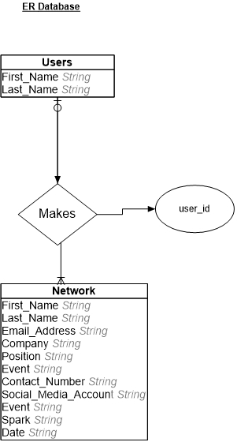
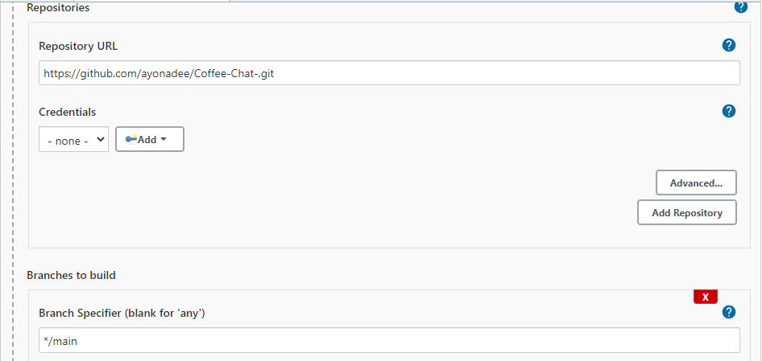
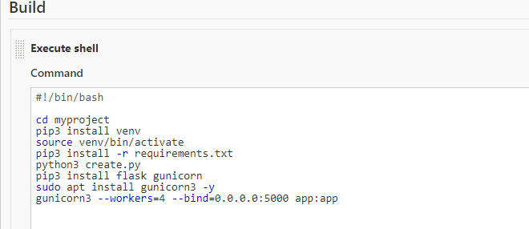
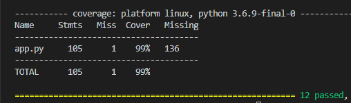
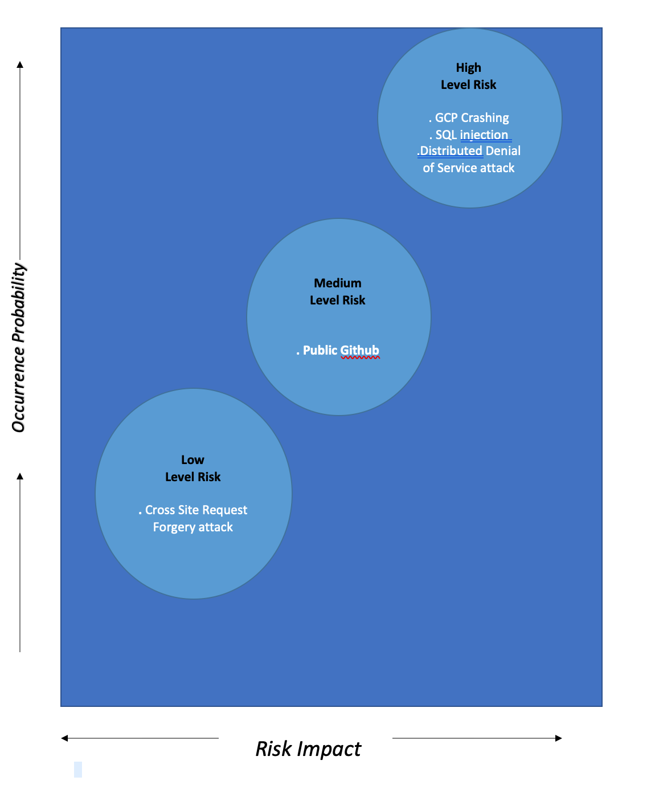

# Coffee Chat
Author: Ayona Duncan

# Project Scope

In general, networking in any field - particularly in 
the field of technology- is an essential and 
sure-fire way of providing opportunities for employment,growth
and exposure. However it can be difficult to track where
and when connections were made, making it tedious to
circle back to these connects when you're job hunting and would
like to arrange a coffee chat. 

Introducing.... Coffee Chat:

A networking 'calling card' storage app that 
allows users to store contact details, name of company, position 
and other key information and memories that the 
user has pertaining to the individuals they 
have encountered at networking events, meetups,
 conferences etc. No more misplacing and exchanging thousands of 
 calling cards, no more random numbers in your phone with no recollection
 of how and when you met. 
 
# Architecture - Flow Chart

Entity relationship diagram:

# Work Progress
I used a Trello board for project management,
please find link attached https://trello.com/b/rCXTle9f/fundamental-project-coffee-chat

# Build 

Setting the jenkins job to download this github repo where my code is:

The build script in the CI Server Jenkins using Flask Gunicorn:

# Tech Stack
The tools and requirements used for this application to run are as follows:

☕︎ Database/Cloud server - GCP(Compute engine) GCP SQL Server

☕︎ Pytest for Unit Testing with Python

☕︎ Programming Language - Python (Flask micro-framework)

☕︎ CI Server - Jenkins

☕Markup Languages for Front-end -  Flask(HTML)

☕︎ CSS

☕︎ VS Code

☕︎ Linux

See requirements.txt file for a full list of all requirements

# Testing

Testing was done with Pytest and Flask Testing

Test analysis:

.All routes were tested for Read, Add, Update and Delete.

.Ensuring that pages with redirects are being redirected.

.Post requests added data and Get requests responded to get requests with a successful status code.

Test Coverage: 99%

# Risk Assessment 

The reason why CSRF attacks are low risk is because
Flask-WTF has built in protection and was set up
via a form.hidden_tag() which was included 
in any page which contains a post method 
and is included in the front-end html as well as a 
SECRET_KEY  which was 
 defined in the back end as an app.config used to
 encrypt data during transit. 
 

# Contributors

Special thanks to Dara Oladapo, 
whose guidance was immensely helpful.

# References
https://www.w3schools.com/

https://collisionf.com/

https://www.monster.co.uk/career-advice/article/what-is-networking-and-how-do-i-do-it

https://www.youtube.com/watch?v=SV1eSbAWfWQ&list=PLBf-QcbaigsKwq3k2YEBQS17xUwfOA3O3&index=10

QA community DevOps learning

# License 
This project is licensed under the terms of the MIT license

